# NormaPrep Diagnostic — Modèle conceptuel de données

> Statut : **proposition**, à valider avant l'écriture du schéma (lot 1).
> Complète la note de cadrage, §11.2.

Le modèle se lit en deux blocs :

- le **référentiel**, alimenté par l'import des fichiers JSON du pipeline de
  contenu, identique pour tous les consultants ;
- les **diagnostics**, saisis par les consultants.

Le consultant n'est pas une entité du plugin : c'est un **utilisateur
WordPress** (table `wp_users`) portant le rôle `npd_consultant`.

---

## 1. Diagramme

Version image : [mcd.png](mcd.png).

```mermaid
erDiagram
    %% ===================== RÉFÉRENTIEL =====================
    THEME ||--|{ SOUS_THEME : "regroupe"
    SOUS_THEME ||--|{ QUESTION : "contient"
    QUESTION ||--|{ NIVEAU : "décrit par (0 à 5)"
    SOUS_THEME ||--o{ RECOMMANDATION : "porte"
    QUESTION |o--o{ RECOMMANDATION : "précise"
    PRESTATION |o--o{ RECOMMANDATION : "répond à"

    REGLEMENTATION ||--|{ REGLE : "déclenchée par"
    REGLEMENTATION ||--o{ EXIGENCE : "exige"
    SOUS_THEME ||--o{ EXIGENCE : "est exigé"

    PROFIL_QUESTION ||--|{ PROFIL_CHOIX : "propose"

    %% ===================== DIAGNOSTICS =====================
    WP_USER ||--o{ DIAGNOSTIC : "mène (consultant)"
    REFERENTIEL ||--o{ DIAGNOSTIC : "sert de base à"
    DIAGNOSTIC ||--o{ PROFIL_REPONSE : "déclare"
    PROFIL_CHOIX ||--o{ PROFIL_REPONSE : "est choisi"
    DIAGNOSTIC ||--o{ DIAG_REGLEMENTATION : "est soumis à"
    REGLEMENTATION ||--o{ DIAG_REGLEMENTATION : "s'applique"
    DIAGNOSTIC ||--o{ REPONSE : "contient"
    QUESTION ||--o{ REPONSE : "reçoit"
    DIAGNOSTIC ||--o{ SCORE : "fige à la finalisation"

    REFERENTIEL {
        string version PK "ex. 2026.1"
        string libelle
        datetime importe_le
        bool actif
    }
    THEME {
        string code PK "G, I, A"
        string libelle
        string couleur "token CARTO"
        int ordre
        decimal poids
    }
    SOUS_THEME {
        string code PK "G3"
        string libelle
        int ordre
        decimal poids
        bool actif
    }
    QUESTION {
        string ref PK "G3-Q01"
        text enonce
        text aide "à demander à voir"
        enum profondeur "essentiel, standard, renforce"
        decimal poids
        text references "ISO, NIST, ANSSI…"
        int ordre
        bool actif
    }
    NIVEAU {
        int niveau PK "0 à 5"
        text description
    }
    RECOMMANDATION {
        string ref PK "G3-Q01-R1"
        text texte
        int seuil "déclenchée si niveau < seuil"
        enum effort "faible, moyen, eleve"
        bool quick_win
        bool actif
    }
    PRESTATION {
        string code PK
        string libelle
        text description
        string lien
        bool actif
    }
    REGLEMENTATION {
        string code PK "NIS2-EE, DORA…"
        string libelle
        enum nature "legale, referentiel"
        text description
        string echeance
        text actions "liste"
        int ordre
    }
    REGLE {
        int id PK
        enum niveau "obligatoire, a_verifier, recommande"
        json conditions "sur les réponses de profilage"
        text critere "le « pourquoi »"
        int priorite
    }
    EXIGENCE {
        enum profondeur "essentiel, standard, renforce"
        decimal cible "0 à 5"
    }
    PROFIL_QUESTION {
        string code PK "P01"
        string libelle
        text aide
        enum type "choix_unique, choix_multiple"
        string condition_affichage "ex. P07B si P07 ≠ non"
        int ordre
    }
    PROFIL_CHOIX {
        string code PK "P01-energie"
        string libelle
        int ordre
    }
    WP_USER {
        int ID PK "table WordPress"
    }
    DIAGNOSTIC {
        int id PK
        string client "pseudonyme possible"
        text perimetre
        text interlocuteurs "fonctions seulement"
        date date_entretien
        enum statut "brouillon, en_cours, finalise"
        datetime cree_le
        datetime modifie_le
        datetime finalise_le
        datetime purge_le
        string consultant_initial "nom, si réattribué"
        datetime reattribue_le
    }
    PROFIL_REPONSE {
        datetime saisi_le
    }
    DIAG_REGLEMENTATION {
        enum niveau_calcule "obligatoire, a_verifier, recommande"
        enum decision "retenue, ecartee, en_attente"
        enum origine "calcul, forcage"
        text critere "copie du « pourquoi »"
        text justification "si forçage ou arbitrage"
    }
    REPONSE {
        int niveau "0 à 5, vide si N/A"
        bool non_applicable
        text commentaire
        datetime modifie_le
    }
    SCORE {
        enum portee "sous_theme, theme, global"
        string code "G3, G ou GLOBAL"
        decimal score
        decimal cible
        decimal ecart
        string reglementation_cible
    }
```

---

## 2. Entités et associations, en clair

### Référentiel

| Élément | Rôle | Cardinalités |
|---|---|---|
| **REFERENTIEL** | Version du contenu importé. Une seule version active à la fois | — |
| **THEME** | Gouvernance, Infrastructure, Applicatif | 1 thème regroupe 1..n sous-thèmes |
| **SOUS_THEME** | G1 à G9, I1 à I9, A1 à A8 | 1 sous-thème appartient à 1 thème et contient 1..n questions |
| **QUESTION** | Question de maturité, avec sa profondeur et son poids | 1 question appartient à 1 sous-thème ; elle est décrite par ses 6 niveaux |
| **NIVEAU** | Description concrète d'un niveau 0–5 pour une question | identifié par (question, niveau) |
| **RECOMMANDATION** | Action proposée quand le niveau est sous le seuil | rattachée à 1 sous-thème, et à 0..1 question ; liée à 0..1 prestation |
| **PRESTATION** | Catalogue des offres, **vide en première version** | 0..n recommandations |
| **REGLEMENTATION** | NIS2-EE, DORA, RGPD, ISO27001… | déclenchée par 1..n règles |
| **REGLE** | Condition sur le profilage → niveau d'assujettissement | appartient à 1 réglementation |
| **EXIGENCE** | *Association* réglementation × sous-thème, porteuse de la profondeur et de la cible | 0..n par réglementation, 0..n par sous-thème |
| **PROFIL_QUESTION** / **PROFIL_CHOIX** | Les 15 questions de profilage et leurs réponses possibles | 1 question propose 1..n choix |

### Diagnostics

| Élément | Rôle | Cardinalités |
|---|---|---|
| **DIAGNOSTIC** | Une mission, menée par un consultant | 1 consultant mène 0..n diagnostics ; 1 diagnostic repose sur 1 version du référentiel |
| **PROFIL_REPONSE** | *Association* diagnostic × choix de profilage | une ligne par choix coché (gère le choix multiple de P14) |
| **DIAG_REGLEMENTATION** | *Association* diagnostic × réglementation : résultat du profilage et arbitrage du consultant | une ligne par réglementation ressortie |
| **REPONSE** | *Association* diagnostic × question : niveau, N/A, commentaire | au plus une réponse par question et par diagnostic |
| **SCORE** | Résultats **figés** à la finalisation | une ligne par sous-thème, par thème et pour le global |

---

## 3. Choix de modélisation à valider

1. **Identifiants stables.** Les éléments du référentiel sont repérés par un
   code lisible (`G3`, `G3-Q01`, `NIS2-EE`, `P01-energie`), comme les
   références des scénarios du quiz. En base, chaque table garde une clé
   technique numérique ; le code est unique et sert à l'import rejouable.

2. **On ne supprime jamais un élément déjà utilisé.** Si une question
   disparaît des fichiers JSON, l'import la marque `actif = non` au lieu de
   l'effacer : les diagnostics qui y ont répondu restent intacts. Les
   éléments jamais utilisés sont, eux, supprimés.

3. **Les conditions de déclenchement sont stockées en JSON**, par exemple :
   `{"tous": [{"P01": ["energie", "transport"]}, {"P02": ["eti", "ge"]}]}`.
   Modéliser chaque condition en tables (opérateurs, opérandes) serait lourd
   pour un gain nul : ces règles sont écrites dans les fichiers du pipeline et
   seulement lues par le plugin.

4. **Le profilage est enregistré choix par choix** (PROFIL_REPONSE) plutôt
   qu'en un bloc JSON dans DIAGNOSTIC. Cela permet de rejouer le calcul des
   réglementations à tout moment et, plus tard, de faire des statistiques.

5. **DIAG_REGLEMENTATION garde la trace de l'arbitrage.** Le calcul propose
   (`niveau_calcule`), le consultant décide (`decision`), et toute décision
   contraire au calcul exige une `justification`. Le « pourquoi » est copié
   pour que le rapport reste stable si le référentiel évolue.

6. **Les questions posées ne sont pas stockées.** Elles se déduisent des
   réglementations retenues (profondeur maximale par sous-thème). Si le
   profilage change en cours de route, les réponses déjà saisies à des
   questions qui ne sont plus posées sont conservées mais ignorées du calcul.

   *Exemple.* Une PME de services numériques. Au profilage, aucun lien avec
   la finance : I6 « Sauvegardes » est en profondeur `standard`, le
   questionnaire pose I6-Q01 et I6-Q02. En entretien, on apprend que le
   client héberge l'outil de gestion d'une banque : le consultant corrige P06
   (« prestataire IT pour la finance »), DORA est retenu, I6 passe en
   `renforce` et la question I6-Q03 apparaît, à remplir. Les réponses à
   I6-Q01 et I6-Q02 sont intactes.

   Cas inverse : P13 avait été coché par erreur, le CRA était retenu et la
   question A3-Q04 (`renforce`, SBOM) a reçu une réponse. Le consultant
   corrige P13, le CRA est écarté, A3 redescend en `standard` : A3-Q04
   disparaît du questionnaire et du calcul, mais sa réponse reste en base. Si
   le CRA est de nouveau retenu, elle réapparaît sans ressaisie.

   À la finalisation, SCORE fige ce qui a réellement compté ; les réponses
   hors périmètre restent en base (traçabilité) mais n'apparaissent pas dans
   le rapport.

7. **SCORE fige les résultats à la finalisation** (score, cible, écart,
   réglementation qui fixe la cible). Le rapport d'un diagnostic finalisé ne
   bouge donc plus, même si le référentiel change. C'est aussi la base de la
   future comparaison de deux diagnostics. Tant que le diagnostic n'est pas
   finalisé, les scores sont calculés à la volée.

8. **Confidentialité.**
   - Toutes les tables « diagnostic » sont reliées à DIAGNOSTIC : une
     suppression définitive efface le diagnostic et tout ce qui en dépend.
   - `purge_le` est calculé à la finalisation (finalise_le + durée réglée) ;
     la purge quotidienne supprime les diagnostics échus.
   - Un diagnostic **jamais finalisé** est purgé selon la même durée,
     comptée depuis sa dernière modification, pour éviter les brouillons
     oubliés.
   - Si un consultant est supprimé de WordPress, ses diagnostics sont
     **réattribués à l'administrateur** (compte désigné dans les réglages,
     par défaut le premier administrateur), pour la traçabilité. Le nom du
     consultant d'origine et la date sont conservés dans `consultant_initial`
     et `reattribue_le`. La purge selon la durée de conservation continue de
     s'appliquer à ces diagnostics.

9. **Pas de clés étrangères déclarées en base**, comme dans le quiz :
   `dbDelta` les gère mal. L'intégrité (suppressions en cascade, contrôles)
   est assurée par le code.
